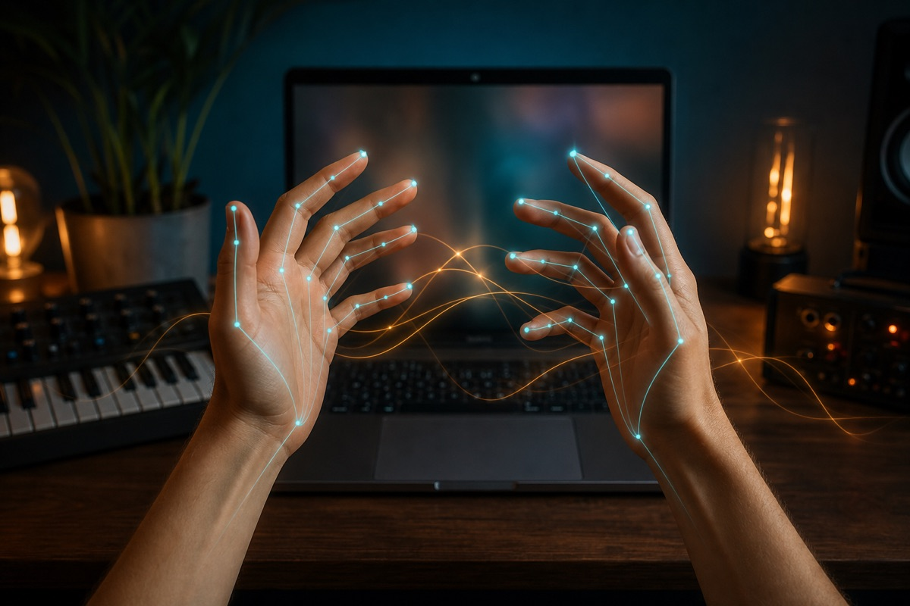

# Gesture Synth

A browser-based synthesizer controlled with hand gestures.

Try it online: [Gesture Synth](https://www.gesturesynth.co/)

## Product preview



Gesture Synth turns two hands into a playable browser instrument. Camera frames,
hand landmarks, synth audio, microphone audio, and recordings stay on the local
device; media is not uploaded to the application.

## Supported gestures

Keep both hands visible to the camera. Hold a shape briefly so the tracker can
stabilize it before changing to the next gesture.

### Left hand: harmony

| Gesture                                | Result            |
| -------------------------------------- | ----------------- |
| 1-5 extended fingers                   | Scale degrees I-V |
| Index + pinky (middle and ring folded) | Scale degree VI   |
| Index + pinky + thumb                  | Scale degree VII  |
| Tilt inward                            | Major             |
| Tilt outward                           | Minor             |

### Right hand: voicing and tone

| Gesture                    | Result                                                   |
| -------------------------- | -------------------------------------------------------- |
| 1 non-thumb finger         | Root position                                            |
| 2 non-thumb fingers        | 1st inversion                                            |
| 3 non-thumb fingers        | Major/minor 7th                                          |
| 4 non-thumb fingers        | Dominant 7th in major mode, diminished 7th in minor mode |
| Thumb in / thumb out       | Higher / lower octave                                    |
| Tilt inward / tilt outward | More / less filter                                       |
| Raise / lower the hand     | Louder / softer volume                                   |

## Technical stack

- [TanStack Start](https://tanstack.com/start) with Vite and Nitro
- React 19 and TypeScript
- [MediaPipe Tasks Vision Hand Landmarker](https://ai.google.dev/edge/mediapipe/solutions/vision/hand_landmarker/web_js) with a self-hosted model and WASM runtime
- Web Audio API for the synthesizer engine
- Canvas 2D and `MediaRecorder` for local MP4 performance recording
- Tailwind CSS 4, shadcn/ui, and Lucide icons
- pnpm for package management

## Browser compatibility

The complete experience has been tested in the current desktop release of
Google Chrome. It requires a secure context (`https` or `localhost`), a working
camera, Web Audio, WebAssembly, and canvas support.

Edge, Safari, Firefox, mobile browsers, and embedded in-app browsers may work,
but are not currently guaranteed. MP4 recording additionally depends on the
browser's `MediaRecorder` codec support. Camera permission is requested when
the instrument starts; microphone permission is requested only when recording
begins.

## Run locally

Requirements: Node.js 20 or newer and pnpm.

```bash
git clone https://github.com/a3011336204-cmyk/gesture-synth1.git
cd gesture-synth1
pnpm install
pnpm dev
```

Open [http://localhost:3000](http://localhost:3000) and allow camera access.
The public instrument does not require a database, account, payment provider,
or storage secret. Copy `.env.example` to `.env.development` only when you want
to customize the public app configuration or optional analytics.

Useful verification commands:

```bash
pnpm test
pnpm exec tsc --noEmit
pnpm build
```

## Online experience

Open [gesturesynth.co](https://www.gesturesynth.co/) to play without installing
anything. Public deployments must use HTTPS so browsers can expose the camera.

## Privacy and source notes

Hand tracking and sound generation run locally in the browser. Optional
recordings are mixed and downloaded locally as MP4 files and are not stored in
the cloud. See [THIRD_PARTY_NOTICES.md](./THIRD_PARTY_NOTICES.md) and
[docs/source-provenance.md](./docs/source-provenance.md) for third-party
licenses, image sources, and authorization records.
